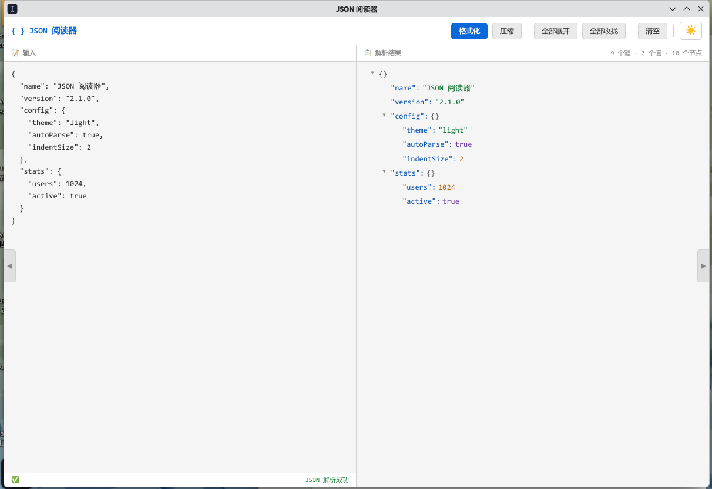
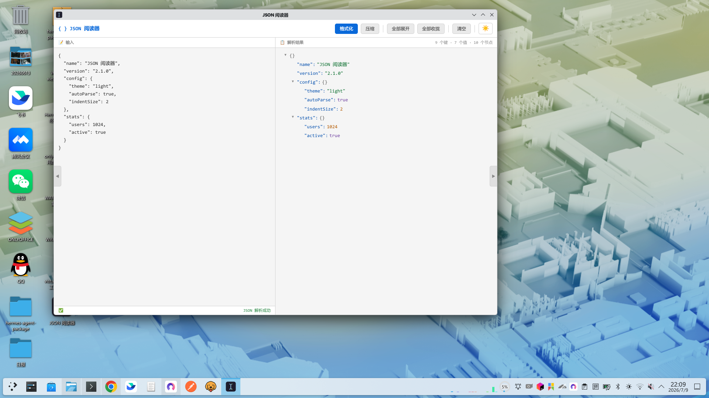

# JSON 阅读器

> 粘贴 JSON 即可展开/收拢查看的轻量级桌面工具。




## 功能

| 功能 | 说明 | 快捷键 |
|------|------|--------|
| 自动解析 | 左侧粘贴 JSON，右侧实时渲染树形结构 | — |
| 展开/收拢 | 点击节点前 `▼` 箭头折叠或展开 | — |
| 全部展开/收拢 | 工具栏一键操作 | — |
| 格式化 | 美化缩进 JSON | `Ctrl+Enter` |
| 压缩 | 压缩为一行 | — |
| 搜索 | 搜索键名或值，上下导航 | `Ctrl+F` |
| 复制键值对 | 悬停任意行点 📋，复制完整 `"key": value` | — |
| 复制整块 | 悬停对象/数组行点 📋块，复制整个子树 JSON | — |
| 花括号匹配 | 点击右侧树节点，左侧自动定位对应 JSON 块 | — |
| 面板折叠 | 左右面板可独立收起，小屏友好 | `Ctrl+B` |
| 主题切换 | 浅色/深色一键切换，自动记忆偏好 | — |
| 语法高亮 | 字符串/数字/布尔/null/键名分色显示 | — |

## 项目结构

```
json-viewer/
├── index.html          # 主界面（571行，单文件全功能）
├── main.js             # Electron 主进程入口
├── package.json        # npm 配置与依赖
├── icon.png            # 应用图标 PNG（256×256）
├── icon.ico            # 应用图标 ICO（多尺寸）
├── .gitignore          # Git 忽略规则
├── README.md           # 本文件
```

## 技术栈

- **前端**：纯 HTML/CSS/JS，零框架依赖，单文件即可运行
- **桌面壳**：Electron 33
- **打包**：electron-builder（可选，生成独立 .exe）

## 快速开始

### 方式一：浏览器直接打开（推荐，无需安装）

双击 `index.html` 即可在浏览器中使用，功能完整。

### 方式二：Electron 桌面应用

```bash
# 1. 安装依赖（仅首次）
npm install

# 2. 启动
npm start
```

### 方式三：打包为独立 EXE

```bash
# 安装打包工具
npm install --save-dev electron-builder

# 打包为便携版 EXE
npm run build
# 输出在 dist/JSON阅读器.exe
```

## 移植到其他系统

### Windows → macOS

```bash
# 1. 复制整个 json-viewer 文件夹到 macOS
# 2. 安装依赖
cd json-viewer
npm install

# 3. 启动
npm start

# 4. 打包为 macOS 应用（可选）
# 修改 package.json 中 build.win 为 build.mac
npm run build
```

### Windows → Linux

```bash
# 同上，打包时改为 build.linux
```

### 纯浏览器模式（跨平台零依赖）

直接复制 `index.html` 到任意设备，浏览器打开即用。

## 分发方式

| 方式 | 适用场景 | 文件 |
|------|----------|------|
| 源码分发 | 开发者、需要定制 | 整个文件夹（不含 node_modules） |
| EXE 分发 | Windows 普通用户 | `dist/JSON阅读器.exe` |
| 网页分发 | 任何平台、无需安装 | `index.html` 单个文件 |

## 自定义

### 修改默认主题

编辑 `index.html` 第 2 行：

```html
<!-- 默认浅色 -->
<html lang="zh-CN" data-theme="light">

<!-- 改为默认深色 -->
<html lang="zh-CN" data-theme="dark">
```

### 修改应用名称/图标

1. 替换 `icon.png`（保持 64×64 以上）
2. 修改 `package.json` 中 `productName` 和 `appId`

## 依赖

- **运行时**：仅 Electron（桌面模式），浏览器模式零依赖
- **开发**：Node.js ≥ 18，npm ≥ 9

## 许可

MIT
